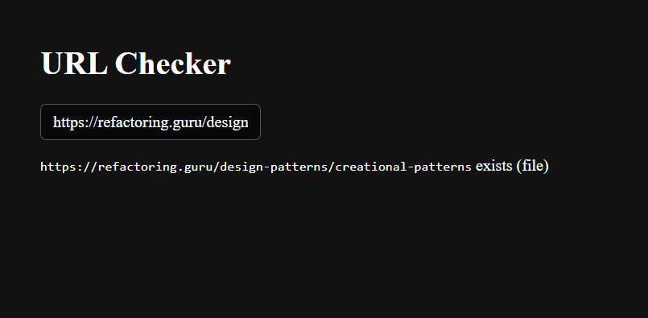

# URL Checker

A small Vue 3 + TypeScript app that checks whether a URL exists as a file or folder.


## Run it

```bash
npm run install:app   # one-time, installs the inner package
npm run dev           # vite dev server
npm run test          # vitest
```

The app lives in `tuta-url-checker-vue/`. The root `package.json` is just a script proxy so commands work from the repo root.

## Architecture

`UrlChecker.vue` is the input + status display.
It calls `useUrlStatus` (the composable), which handles debounce, validate, race-handle, and the state. 
The composable in turn calls `checkUrlExists`, defined as `withTimeout(withThrottle(withRetry(basicCheckUrlExists)))` ,async wrappers composed around an injectable impl (decorator design pattern). 

`basicCheckUrlExists` is the backend's Mock.

 Adding a new concern (logging, caching, metrics) means adding another wrapper, not editing existing ones.

### Files worth opening first

- **`src/composables/useUrlStatus.ts`**: orchestration. Debounce, URL validation, state-machine transitions, race-condition handling. Brain of the UI.
- **`src/services/urlExistence.ts`**: three lines. Composes the wrappers. Where you'd add a new layer (logging, cache, metrics) without touching anything else.
- **`src/services/urlExistenceMock.ts`**: the swappable impl. Replace this file when a real backend lands.
- **`src/libs/retry.ts`, `throttle.ts`, `timeout.ts`**: one concern per file, each exports a `withX(fn)` HOF.
- **`src/libs/errors.ts`**: `HttpError` carries an HTTP status so retry can branch on it instead of parsing messages.
- **`src/types.ts`**: `CheckState` discriminated union (state machine) + `CheckUrlExists` port contract.
- **`src/__tests__/useUrlStatus.spec.ts`**: includes the race-condition test (`"Keep order and abort outdated updates"`).
- **`src/__tests__/retry.spec.ts`, `throttle.spec.ts`**: wrapper tests.

---

# Notes

## Why Vue 3

Reactive composables fit this kind of input-driven, debounced-async UI well. The state machine lives inside `useUrlStatus` as plain reactive refs, no extra state library needed. It's also the framework I have the most experience with.

## What I focused on

I tried to treat this like real engineering: you rarely get the full scope upfront, and I needed to judge where to over-invest in extendability and scalability vs where simplicity is the right call.

Focus areas:
- **Resilience**: retry, throttle, race handling.
- **Extendability**: injection-based architecture (swappable impl).
- **Dev experience**: husky pre-commit blocks bad commits (lint + types + tests)

## Throttle

Sliding window: at most N calls in any rolling Y-second window. No calls dropped, they queue up. Picked this because it tracks real backend pressure without adding lag on bursty input.

Other options I considered:
- Minimum gap between call starts. Simple, but adds lag under sustained typing since every call waits for the previous gap to clear.
- Token bucket (X calls per Y seconds). felt like overkill here.

Rolling my own would have cost more time than the algorithm was worth, and `p-throttle`'s semantics are close enough.

PS: The unit tests for the wrappers took me a lot of time to get right.

## Retry

On `HttpError(429)`, exponential backoff via `p-retry`. Other errors aren't retried. 
Order is `throttle => retry => Backend` so one logical call uses one throttle slot no matter how many retries fire (since its not the user's fault ).

## Logging

Used default `console.log`. A real app would use a logger.

## Architecture

SOLID where it pays off: SRP for the wrapper files, Dependecy injection to ensure implementation swap (for testing for example). 

Patterns in play: function-composition decorators, generation counter for cancellation, port/adapter for the service.

## Dependencies

- `p-throttle`: sliding-window, no risky transitive deps
- `p-retry`: same author, exponential backoff + selective retry, one tiny transitive dep

Both from same Auther & well maintained. made sure version number is picked to avoid futur regressions.

## Repo layout

Repo isn't Vue-specific. If a backend or DB shows up later it can live next to the frontend, set up so it can grow into a monorepo.

## How it evolved (key commits)

The arc was: ship small => make it testable => catch and fix a real bug => harden against backend pain => leave structure for the next iteration.

1. **`36e4958`, feat: UI + composables + types + service.** First working slice. Simple input => mock service. No retry, no throttle, no abort. Goal was visible behavior end-to-end.
2. **`13bca15`, chore: env var + inject services.** Refactor for testability. Couldn't write meaningful tests when the composable hard-imported the service.
3. **`3c3052e`, it: useUrlCheck unit tests.** Tests for the state-machine paths.
4. **`2fd472b`, bug: manage concurrent updates correctly.** Found a real race condition (screenshot below). Slow request beating a faster one would overwrite the correct status. Fixed with a generation counter + a test to lock it in.

   

5. **`070c8b5`, chore: throttle + retry.** Added the resilience layer.
6. **`9445ac3`, ut: tests for retry + throttle wrappers.** The hard one. Fake timers + wrapper composition was fiddly.
7. **`17d19d3`, chore: stub withTimeout (TODO).** Slot ready for timeout logic. Wired into the composition as a no-op so adding the real logic later doesn't need any other file changes.

## Current Limitations

- **No request cancellation** The `CallOrder` counter discards stale *results* but doesn't cancel in-progress calls. If a slow call eventually succeeds after a faster one, the order check saves the UI but the wasted request already hit the backend. Abort would actually stop it.
- **Caching for scalability.** The same URL re-fires on every check.
- **Graceful degradation.** Right now a backend outage just surfaces as `error`. Could fall back to a cached/last-known result...
- e2e tests with Playwright (currently unit-only)

- **Split `useUrlStatus` file**, it does watching + validation + debouncing + state machine + race handling, five jobs in one composable.
- **UI is ugly**. Functional and accessible but unstyled. No loading skeleton, no visible retry indicator
